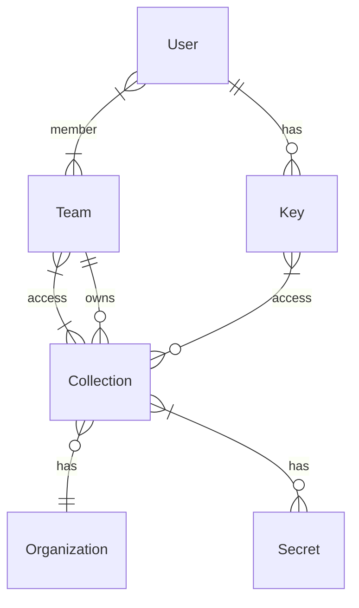

# Tresor

> A secrets vault for teams

Keep your secrets only visible for your eyes and share them as needed with your
team.

## Motivation

After using some solutions for managing secrets, I saw some problems
regarding security and management capabilities when dealing with a lot of
secrets shared across multiple teams.

Most of the tools I used were proprietary tools or tools, that were not made
for sharing secrets. Especially when it comes to secrets, I think Free and
Open Source Software is the only suitable option. This is where you put your
keys to the kingdom. These tools have to be open for you to review. All of
the code involved.

## Requirements

As I already made some thoughts about storing, sharing and managing
secrets, here is an opinionated list of requirements:

The software should

- be free and Open Source.
- be able to share secrets between individual people and teams.
- provide strong encryption. Only the devices, that will use/read the
  secrets should be able to decrypt the secret.
- keep some fields in cleartext, so you can search without having to
  decrypt everything.
- provide an API for extension.
- keep a local (encrypted) copy of the data
- provide events (email, webhooks etc.) for secrets, that expire

## Architecture

As some of the requirements say, only the devices reading the secrets should
be able to decrypt them. To achieve this, the secrets should be encrypted using
a symmetric encryption algorithm, such as AES-256 or ChaCha20. The secrets
should organized in collections and for each collection, a encryption
password is generated. This password is then encrypted using asymmetric
encryption for each device a user with access has. When requesting the
secrets, only the encrypted version is going over the wire and is decrypted on
the device using the private key of the asymmetric encryption algorithm.

Secrets live within one or more collections. These collections are assigned to
an organization. Access to the collections is granted via teams within the
organization. Each individual user can be in multiple organizations as well as
multiple teams.

## Security

Logging into the API should be possible with SSO and simple username and
password as well as MFA. Albeit, this login only will get you into a
"management" mode on the server. You will be able to see what items there are
and also see the cleartext values of them, but the encrypted secrets will not be
exposed in this mode. To get access to these secrets, you have to request
another token for a specific key, which will be send to your client encrypted
with the stored public key. Only your client should be able to decrypt this
token, as you are (hopefully) the only person in posession of this key.

The secrets however are stored on the server in an encrypted way, so you will
not be able to read them just by getting hold of the token. You will also need
the private key to decrypt them.

In management mode, you will be able to add a key, but this key will not be
active right away. A rouge actor might got hold of some of your credentials and
try to add his own key to your keyring to gain access to the secrets. A newly
added key **must** be validated by signing it with an existing key. The only
key, that does not need validation is the first key, that is added to the user.
